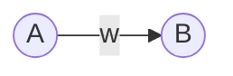

We describe here what are the steps to follow in order to build an artificial brain.
Note that we do not seek to build a brain-like computing system, which would directly emulate general intelligence.
Instead, we seek to define a class of computing systems, such that many instances of it realize general intelligence.
In parallel of that, in the previous and later phases (3- and 5+) we define a process that allows us to find such an instance.

# goal: what we want our computing system to realize
We want our computing system to have the potential to emulate general intelligence.
To do this, it must beforehand satisfy the following prerequisites:
- no characteristic scale in space, time or complexity (scale invariance along these three axes[^1])
- modularity[^1]
- generality[^1]
- care for laziness[^1]
- the more information it contains, the easier it absorbs new information
- the possibility of undergoing dramatic changes: our computing system should be able to change the way it processes information, regardless the amplitude of that change (no characteristic behavior).

Said otherwise, as a computing system, our artificial brain should be able to implement any algorithm, save resources to run these algorithms more efficiently and memorize an arbitrary amount of information.
Ideally, a general intelligence will memorize everything, recognizing any pattern, able to exploit these patterns to perform any task with minimum use of resources, and able to display open-ended novelty in behavior or ideas.
Importantly, a general intelligence is able to step back (e.g. dramatically change its world model or way of thinking) and constantly improves on any of the aforementioned properties (novelty, sparing resources, memorizing, etc).
Lastly, a general intelligence is able to model its own behavior as well as modify selectively any specific aspect of it, which makes it able to learn how to improve itself faster.

These properties are not possible to implement with traditional current deep learning models, so we have to build our own: the artificial brain.

An artificial brain consists in a weighted directed temporal network (with higher-order effects) of elementary computing units called neurons, rules to evolve both the network topology and the parameters of the neurons, a protocol for parasynaptic communication (i.e. communication between neurons that bypass the synaptic network) and a protocol for long-range node-to-node communication in the synaptic network (inspired from the Internet routing protocol and the blockchain algorithm).
Note that parasynaptic communication is equivalent to assume the existence of a second parallel temporal network between neurons.
Importantly, any parameter of an artificial brain is subject to plasticity in a context-dependent way.
Also, there is no black box within an artificial brain: any intermediate computation within a neuron leaves a trace on the neighbouring neurons.
This choice is inspired from biological brains, where subthreshold fluctuations of the membrane potential are detected by neighbouring neurons and participate to important neural functions (see [this paper](https://www.mdpi.com/2076-3425/13/1/74) and [this paper](https://www.pnas.org/doi/pdf/10.1073/pnas.1716933115)).
Aside from the relevance of this mechanism in biological brains, this choice allows our artificial brain to access the detailed steps of each neuron, making it possible to share variables between neurons, reuse some intermediate computations and adjust the behavior of a neuron depending on the context, including e.g. the correction of some errors.

For a comparison between brains and in silico computing systems, see [this paper](https://www.frontiersin.org/journals/cellular-neuroscience/articles/10.3389/fncel.2023.1220030/full).

Note that we do not aim at reproducing a biologically plausible brain ; this would be completely out of the scope of modern computers.
Indeed, the human brain possesses 86 billion neurons, each of these neurons having in average 10 000 synapses.
Moreover, each neuron is at least as complex as a [deep artificial convolutional neural network, being e.g. to perform XOR computation within its dendritic tree alone](https://www.cell.com/neuron/pdfExtended/S0896-6273(21)00501-8).
Besides neurons, the brain contains [as many glial cells](https://pmc.ncbi.nlm.nih.gov/articles/PMC5063692/pdf/nihms799882.pdf), which play [a direct and critical role in the brain computations](https://pmc.ncbi.nlm.nih.gov/articles/PMC2894949/pdf/rstb20090313.pdf) and are yet not understood.
Said otherwise, it is simply impossible to simulate a biological brain, even on modern supercomputers.

That is why we include as many symbolic components and imperative programming instructions as possible (e.g. the node-to-node communication protocol), which we will describe in the following.

To recap, an artificial brain is a computing system satisfying the following properties:
- a temporal directed weighted network, called the synaptic network
- elementary computing units called neurons. Neurons of various types coexist, including symbolic processing units. The precise definition of a neuron will be given in the following.
- another temporal network called the parasynaptic network (inspired from the hormons released in the brain)
- every parameter is subject to context-dependent plasticity
- no black box: computations within each neuron are available to other neurons
- a long-range communication protocol allowing neurons from distant areas to communicate via the synaptic network
- a module called an observer, that computes various statistics about the dynamics of the whole brain and makes these statistics available to the brain itself
- components or modules explicitly designed for long-term storage (building upon the ideas of [neural Turing machines](https://www.researchgate.net/profile/Faramarz-Safi/publication/344617740_A_Review_on_Neural_Turing_Machine_NTM/links/602fe79da6fdcc37a83954d2/A-Review-on-Neural-Turing-Machine-NTM.pdf), [engrams](https://pmc.ncbi.nlm.nih.gov/articles/PMC9065729/) and [epigenetic storage of information](https://www.nature.com/articles/s41539-019-0048-y.pdf))
- a way to track time

Let us now detail the precise steps we will follow in order to implement the concept of artificial brain.

# step 1: the input and output channels
The first step is to precise which sensory information is sent to the brain and which motor output is sent to the world.
In particular, the brain receives 2 types of input: visual and textual.
Visual input consists in an integer-valued matrix while textual input consists in a sequence of pairs (agent_id:int,post:str).
Each of these inputs is truncated by an attention window.
For example, the visual input is actually received from a rectangular grid of fixed size.
The brain has the possibility to move this window, so that it is possible to access the whole content of larger images.
A similar attention window has to be implemented for textual input, except it is 1D instead of 2D for vision.
The last thing to be implemented in this first step is a masking module:
For visual input, it enables the brain to ignore all the visual input but one rectangular area (which is a subset of the attention window, of course).
(similar for textual input but 1D instead of 2D)
This module allows the brain to focus on a subpart of the image, just as we can focus on a narrow area of our vision field.

The motor output encompasses the control of the input channels, as well as whether the agent decides to post a message, and which button it activates.
Also we should implement the possibility that the state of the output layer is also part of the input layer, so that the brain knows which action it has taken.
However, this is not necessary, as feedback at a higher level may be enough (the brain does not need to know which exact muscles have been sollicitated to develop a model of itself).

# step 2: the sensory modules
We implement multiple parallel pathways to process the same sensory input.
This may seem reminiscent of using multiple filters in convolutional networks but we add here important properties.
In our context, a pathway consists in a computing system (not necessarily a neural network as well shall see), which receives its input from a router and sends its output to another router.
Also a pathway has additional entry points that allows other modules of the brain to pilote it (modifying the computations it performs).

In a first implementation, 3 such pathways will be implemented:
- a machine learning pathway, consisting in state-of-the-art convolutional nets (but with much less parameters due to our resources constraints).
To design this pathway, inspiration will be drawn from the input module of [DeepMind's Dreamer](https://arxiv.org/pdf/2301.04104), because it is able to process small images (our case).
- a symbolic processing pathway, consisting in an interface to a image processing library of operators like Fourier transform, wavelet transform, rotations, etc
- a trivial pathway, which consists in doing nothing

The router that feeds the pathways is controlled by other modules in the brain, and decide to which pathway the sensory input is sent after preprocessing.
Note that the router can send this input to multiple pathways, a single pathway or no pathway at all.

The router that receives data from the pathways can choose to forward these data to other modules or resend some of these data to the router feeding the pathways for further processing.

# step 3: basic symbolic components
The parts of the brain other than the sensory or motor pathways are referred to as the deeper brain.
This is where the most abstract computations are supposed to take place, since the deeper brain is piloting the other modules.
Besides usual neurons, the deeper brain has access to symbolic components to perform computations.
These components include:
- a recorder (able to record time series of neural outputs and replay them on demand)
- a numeric calculator (able to perform exact arithmetic operations)
- a database-like storage (as a first implementation we consider relational databases together with SQL for manipulating them)
- a simpler storage, closer to those used in neural Turing machines
- a simplified version of a programmable computer endowed with a programming language. More precisely, algorithms written in this language take the form of rewriting rules that are applied to the input sequence. The brain has the possibility to select the desired rewriting rules from a memory or add new rules.
This gives the possibility to process time series of neural signals by relying on an algebra of abstract symbols rather than synaptic communication.
- a clock (it has no input but various outputs, each of these outputs oscillates with a fixed and different period)

# step 4: the synaptic network
This is where it becomes necessary to define what we mean by neuron.
Indeed, this step consists in implementing various types of neurons.

A neuron is a causal deterministic process taking as input a multivariate temporal series and outputting a univariate temporal series.
It processes its input in four steps, that we have ordered in time:
1. **input aggregation** convert the multiple signals receive from the in-neighbors of the neuron into a signal that the neuron can handle (usually these signals are aggregated into a single scalar via a weighted sum)
2. **update the internal state** process the aggregated input (in traditional current machine learning, it is done by applying a non-linear function such as ReLU to the aggregated input)
3. **read the output** just like the brain, the neuron has an input part, an inner part and an output part. In traditional machine learning, the output is equal to the internal state, but in neuroscience this is not the case. In any case, the output is deduced from the internal state only.
4. **functional role** interpret the neuron output to decide what effect it has on the out-neighbors of the neuron. This fourth step is usually implicit. Most of the time, only two functional roles are implemented: the output layer, where the output of a neuron is interpreted e.g. as a motor command, and the basic role we expect from a neuron, where the output is interpreted as a number. However, many other functional roles can be designed, for instance a modulatory role, which is known from neuroscience, or other roles like gate, router, switch, freeze, etc.

The goal of this step is to implement various possibilities for each of these 4 aspects of how a neuron processes information.

# step 5: beyond synaptic communication
The goal of this step is to implement the possibility for a neuron to communicate directly with neurons which are not its out-neighbors.
This includes both a parasynaptic network and a communication protocol, that allows a neuron to send some signal to another specific neuron located anywhere in the brain.
The two differ in that, that the communication protocol is one to one (one neuron talks to a single other neuron), while the parasynaptic communication is one to many (one neuron talks to a group of other neurons).

One possible implementation of parasynaptic communication is to rely on conditionals, i.e. a given neuron should transmit to any neuron satisfying some condition.
For instance, we could imagine an inhibitory neuron that transmits to any neuron displaying an activity overload.

# step 6: plasticity
Earlier forms of communication (synaptic and parasynaptic) alter directly the state of the neurons, but not how they connect to each other.
Plasticity allows to alter these connections, or how these connections evolve.
We plan to implement 4 different forms of plasticity, each having complentary strengths and weaknesses.

## pairwise plasticity
The simplest form of plasticity is pairwise (Hebbian) plasticity.
Let us consider A and B 2 neurons and w the weight from A to B as depicted below.

The change in w is usually a polynomial of second order in the outputs x of A and B. Besides, a coefficient eta, that depends only on A, can be modified by some modulatory neurons (not shown here). The complete expression of the change in w writes:
$$\Delta w=\eta_{A}\left(\alpha_{1}x_{A}x_{B}+\alpha_{2}x_{A}+\alpha_{3}x_{B}+\alpha_{4}\right)$$

A shortcoming of Hebbian plasticity is that it is hard to synchronize the update of a large number of synapses.
Also, it does not allow to remove or add new neurons or synapses.
To solve this, other forms of plasticity are required.

## conditional plasticity
It is more suitable to remove or add synapses and neurons.
It consists in applying some change to every component of the brain satisfying some condition.
For example, such a rule could be “duplicate any overloaded neuron”.
For this statement to be well-defined, many statistics should be computed about the brain dynamics.
These include the description of the structural role of a neuron (e.g. is it located at the border between 2 communities, where the notion of community is inherited from graph theory), as well as measures of the impact of a given synapse on the rest of the brain.
Then, rules such as “remove synapse that has no impact” would be well-defined.

## graph rewriting
Contrary to the previous forms of plasticity, this form has no direct impact on the way info is processed in the brain (it does not alter the brain output).
In the realm of imperative programming, this plasticity would be called refactoring:
it does not alter the outcome of the modified algorithm, but reveals useful in the end.
The main benefit of graph rewriting is the savings of resources: it reduces the current brain to a smaller “equivalent” one (be cautious to the quotes here haha).

In its most basic form, graph rewriting would consist in specifying some rewriting rules like e.g. S—>T.
Here S and T denotes unweighted graphs and the rules states that S should be replaced by T.
To apply this rule to the synaptic network, we search for the sub-graphs S' such that the unweighted version of S' is equal to S.
Then we replace S' by T' such that:
- T is the unweighted version of T'
- the weights of T' are tuned in order to match the behavior of S': S' and T' should have the most similar mapping from input to output

## parameter sharing
Just like graph rewriting, this form of plasticity will not alter directly the brain output.
However, contrary to graph rewriting, it will not even alter directly the synaptic network.
Parameter sharing only consists in binding or unbinding parameters together.
By parameter, we mean e.g. the weight of a synapse but it can also be the multiplicative factor $\eta$ or the coefficient $\alpha$ we saw in the context of Hebbian plasticity.
It can also be the internal parameter of a neuron.
More generally, it is any real number appearing in the brain that is not part of a neuron output, input or internal state.

By binding 2 parameters together, we mean that these parameters now share the *exact same value*.
Let us take the example of two synapses of weights w and w’. If these synapses are unbound, w and w’ will evolve independently from each other.
After the synapses bind together, w = w’ is enforced as long as the binding holds.
This binding can occur e.g. if we notice that w and w’ have had a similar evolution for some time. The idea behind this is “help the spontaneous dynamics achieve its goals”.
Then, if 2 parameters stay similar consistently when unbound, we bind them together.
This allows the brain to stop spending resources just to make these parameters alike, and redirect these resources to other ends.

Parameter sharing exists in traditional machine learning, where it has proven very efficient.
One of its most prominent forms is the idea of convolution, implemented in convolutional neural networks.
Here, we propose a more generic and context-dependent way of sharing parameters within a neural network.

# step 7: the observer module
This module aims at computing statistics about the brain as a whole, in particular identifying what components are the most used, what are the useless ones, etc.
These statistics make possible global self-regulation, like avoiding epilepsy by shutting down the most central excitatory neurons, ensuring the brain operates at criticality or that it is coordinated (behaves like a whole).
Moreover, they can guide the definition of conditionals in the context of [conditional plasticity](#conditional-plasticity).

Some statistics are easy to implement:
- distribution of neural activity across the brain
- distribution of plasticity events across the brain
- neuron and synapse centrality
- avalanches of activity
- local firing environments (for each neuron we compute the distribution of the patterns of activation of its in-neighbors). This stat allows to identify which neurons receive input with similar statistics.

Other statistics are more demanding:
- structural roles of neurons, as defined in [this paper](https://arxiv.org/pdf/2003.00056) and [this paper](https://www.researchgate.net/profile/Abdol-Hossein-Esfahanian/publication/228665526_Node_roles_and_community_structure_in_networks/links/0912f509b088580566000000/Node-roles-and-community-structure-in-networks.pdf)
- impact of a neuron on the rest of the brain: how far an event at the level of a neuron propagates into the brain? (for example, how many changes will result from modifying a given parameter of a neuron, or removing that neuron?)

# step 8: accessing local variables
Implement a way that allows internal computations of a neuron to affect its neighbors.

[^1]: These points are discussed in other documents, let us know if you are interested.
